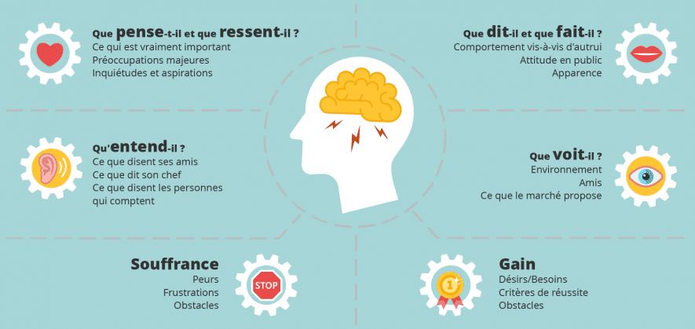

Carte d'Empathie
===

Catégorie
---
Exploration

Illustration
---

Résumé
---
C'est une illustration graphique de l'expérience d'un personae dans un scenario particulier. Il peut être utilisé avec une User Journey Map pour étoffer le comportement d'un personae et renforcer votre connexion emotionnelle avec celui ci.

Temps alloué
---
1 heure.

Matériel nécessaire
---
Papier, stylo, post-it.

Méthode
---
1. Définissez les personae et le/les scenarios.
2. Présentez les à l'équipe. 
3. L'équipe brainstorm et remplie la carte d'empathie.
4. Récupérez et faites la synthèse de la carte d'empathie et de leur reflexion.
