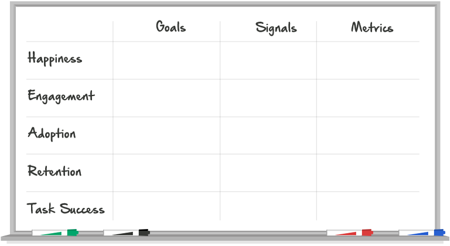

HEART by Google
===

Catégorie
---
Évaluation

Illustration
---

Résumé
---
Ce framework vous aide à mesurer la qualité de l'experience de vos utilisateurs, sur un produit ou une fonctionalité. Choisissez une ou deux catégories sur lesquelles votre produit est focus. Le Process Buts, Signaux, Metriques vous aident à identifier les métriques qui ont un sens. Ils devraient vous guider vers une priorisation naturelle des différentes métriques.

Temps alloué
---
30 minutes

Matériel nécessaire
---
Une feuille vierge comportant le framework HEART

Méthode
---
1. H - Mesure l'engouement des utilisateurs, souvent collecté par une étude (Satisfaction, Facilité d'utilisaion, Compteur de points)
2. E - Niveau d'implication des utilisateurs (Visites par utilisateur par semaine, Nombre de photos uploadé par utilisateur par jour, nombre de partage)
3. A - Gain d'utilisateur pour un produit ou un fonctionalité (Maj vers la dernière version, nouvelles inscriptions, achat pour les nouveaux utilisateurs)
4. R - Le taux auquel les utilisateurs existant reviennent (Nombre d'utilisateurs actif présent au cours du temps, taux de renouvellement, achats répétés)
5. T - Bon fonctionnement, efficacité, et taux d'erreur (Résultats de recherche fructueuse, Temps d'upload d'une photo, completion de création de profile)