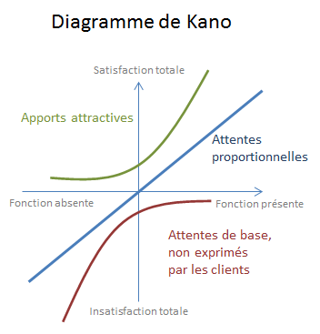

Modèle de Kano
===

Catégorie
---
Définir

Illustration
---

Résumé
---
Il permet d'évaluer les attentes des clients grâce au niveau de satisfaction associé. Vous pourrez alors prioriser les fonctionalités à implémenter.

Temps alloué
---
2 semaines

Matériel nécessaire
---
Liste de fonctionalités d'un produit, une étude comparative. 

Méthode
---
1. Les attentes de base : généralement non exprimées, vous devez impérativement les satisfaire pour rester sur le marché. (aidez-vous d'une étude comparative)
2. Les attentes proportionnelles : la satisfaction augmente avec le niveau de performance délivré par la fonction. (aidez-vous d'ethnographie, empathie map...)
3. Les attentes attractives : le fournisseur surprend son client avec une fonction à valeur ajoutée qu'il n'attendait pas. Les fonctions vont au-delà des attentes client Un terrain propice à l'innovation.
4. Les attentes neutres: implémentées ou non, le client ne sera pas plus satisfait, ni insatisfait. Cette zone ce situe au centre du diagramme.
4. Pour avoir une meilleur visualisation, placez ces fonctionalités sur la courbe.
5. Etudiez la faisabilité, ainsi que le retour sur investissement
6. Priorisez vos tâches.
