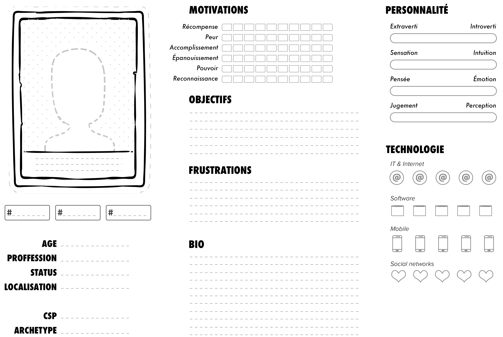

Personae
===

Catégorie
---
Définir

Illustration
---

Résumé
---
Grâce à cette fiche, vous créerez des scénarios d'utilisation d'un produit ou d'un service tandis que les équipes commerciales définissent une stratégie de positionnement, de promotion ou de distribution. Surtout utilisée pour la conception et l'amélioration de l'ergonomie de sites Web, son périmètre d'influence va bien au-delà pour pénétrer l'ergonomie des produits de haute technologie, la stratégie de promotion, la création ou la sélection de circuits de distribution vers les consommateurs.

Temps alloué
---
1 jour.

Matériel nécessaire
---
Papier, stylo.

Méthode
---
1. Collectez des données d'au moins 6 interviews par rôle business ou du segment de marché que vous visez.
2. Identifiez des axes de comportement représentatifs de vos personaes.
3. Synthetisez ces comportement et caracteristique personnelles en un personae.
4. Définissez votre personae primaire. 
