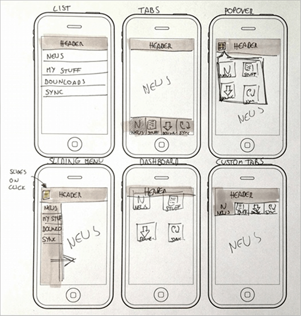

Six to One
===

Catégorie
---
Génération

Illustration
---

Résumé
---
Rapide à mettre en place et ludique, elle permet de générer, développer et affiner les idées. Elle s'applique pour des interfaces mobile ou web

Temps alloué
---
45 minutes.

Matériel nécessaire
---
Feuilles de croquis à 6 petits gabarits.
Feuilles de croquis à 1 grand gabarit.

Méthode
---
1. Distribuez les planches "Six-up" (6 petits gabarits).
2. Laissez les participant dessiner 6 versions d'une interface (15 minutes).
3. Chaque participant présente ses propositions en 2 minutes.
4. Distribuez les planches "One-up" (1 grand gabarit).
5. Chaque participant combine les solutions les plus réussies et converge vers une solution unique. (10 minutes).
6. Chaque participant présente sa proposition en 2 minutes.
7. Relevez les différences et les similarités pour trouver les pistes à creuser, et celles à ecarter.