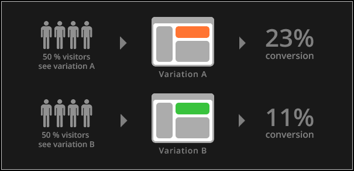

Tests A/B
===

Catégorie
---
Évaluation

Illustration
---

Résumé
---
Le test A/B teste un changement sur un produit / site et détermine la version qui donne les meilleurs résultats auprès des consommateurs.

Temps alloué
---
1 à 2 semaines.

Matériel nécessaire
---
2 versions d'un site et un système de redirection aléatoire.

Méthode
---
1. Déterminez votre métrique de succès (Temps passé, ventes, inscriptions...).
2. Déterminez l'élément qui doit être modifié et testé (couleur, wording, images...).
3. Formulez une hypothèse pour résoudre la problématique rencontrée, et appliquez là sur la version B.
4. Utilisez un outil d'A/B testing pour servir aléatoirement l'une des deux versions.
5. Lancez le test approximativement 2 semaines pour avoir un nombre significatif d'utilisateurs.

Similaire
---
[Tests Multivariés](Tests-multivariés.md)