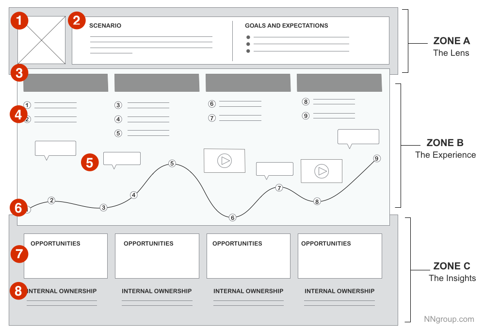

User Journey Map
===

Catégorie
---
Exploration

Illustration
---

Résumé
---
Visualisation de l'experience d'un persona utilisant un produit ou une fonctionalité. Elle illustre chaque point d'interaction et leur ressenti. Elle est utile pour déterminer ce qui a besoin d'être implémenté et comment il doit être implémenté.

Temps alloué
---
3 heures.

Matériel nécessaire
---
Recherche initiale, personas, papier et crayon.

Méthode
---
Construsez votre User Journey Map de la façon suivante :
1. Zone A: Assignez (1) le persona ("qui") et (2) le scénario à examiner (“quoi”).
2. Zone B: Déterminez (3) Les phases découpables de l'experience. Les (4) actions, (5) les pensées, et (6) l'experience émotionnelle de l'utilisateur au cours du scénario peut être agrémenté de citations et vidéos.
3. Zone C: Vous devriez découvrir alors les idées et points de souffrance, ainsi que  (7) les opportunitées sur lequels se focaliser, mais aussi (8) à qui en associer la responsabilité. 