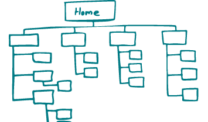

Plan de site
===

Catégorie
---
Génération

Illustration
---

Résumé
---
C'est le premier livrable qui montre ce que vous allez créer. Il représente l'architecture et liste les ressources proposées. Il montre comment la navigation devrait être structurée et la relation entre les pages. La structure fournie permet de commencer une estimation du développement. 

Temps alloué
---
1 à 3 heures.

Matériel nécessaire
---
Feuille, stylo, ou un outil de design.

Méthode
---
1. Listez préalablement les fonctionalités du site sur des cartes, de préférence avec les parties prenantes.
2. Invitez une personne à arranger hierarchiquement les cartes par catégorie.
3. Enregistrez le résultat.
4. Réiterez l'étape 2 et 3 une dizaine de fois.
5. Faites une analyse statistique des résultats, et utilisez les pour créez une cartographie.